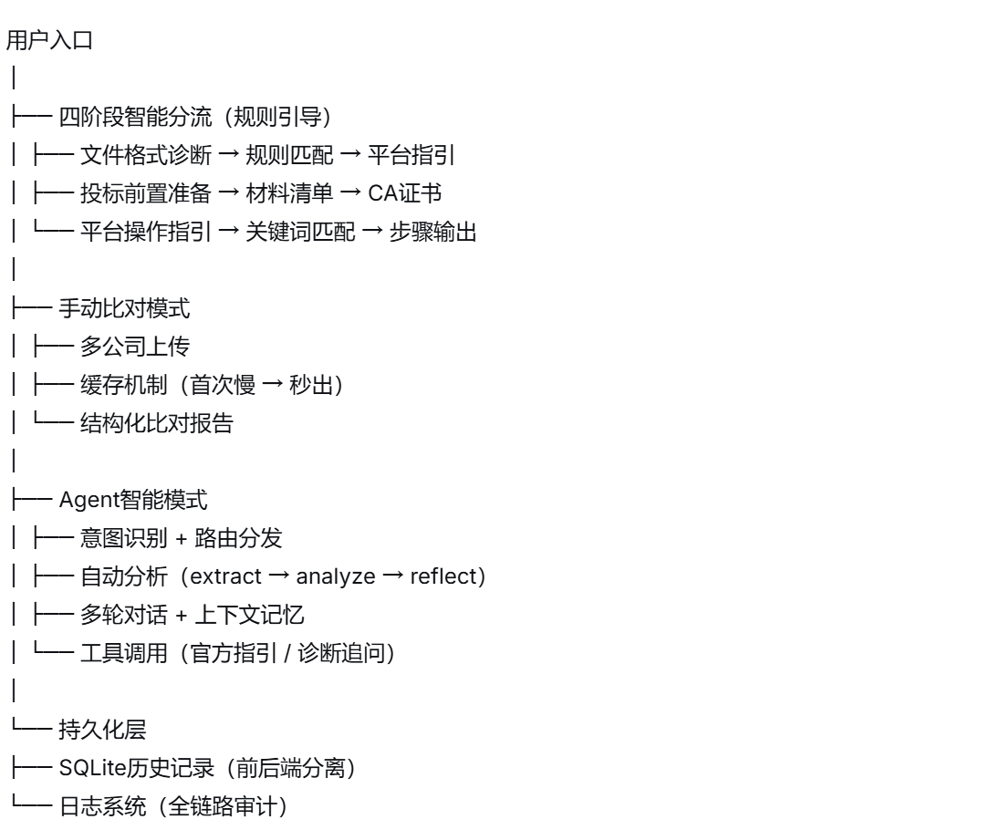
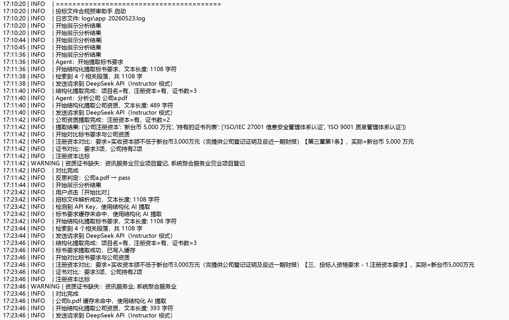
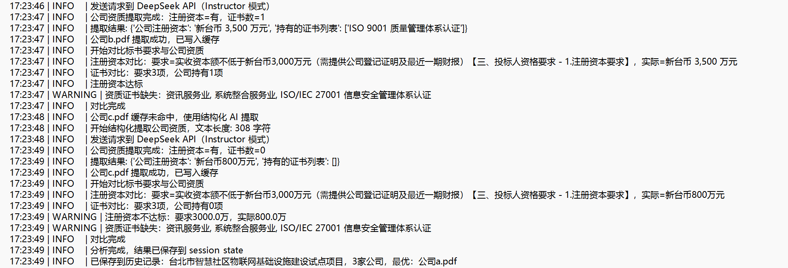
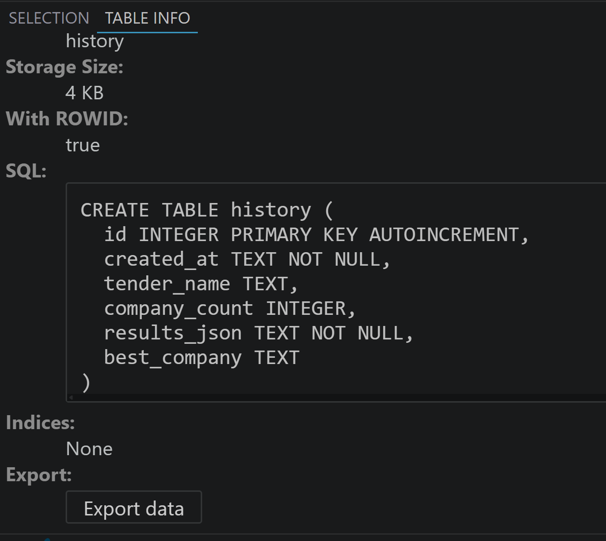
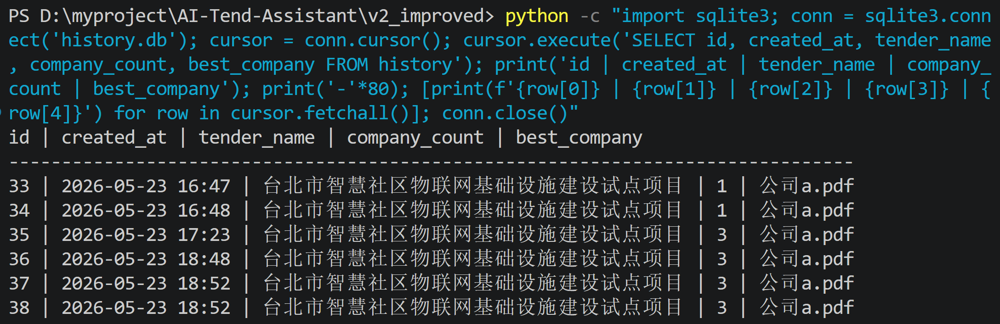

# tender-ai-mvp

> 面向投标场景的全流程 AI 辅助决策工具

## 《智能投标风险分析系统》

**作者**：[@YCP787887](https://github.com/YCP787887)  
**时间**：2026年5月  
**项目定位**：面向招投标场景的全流程 AI 辅助决策工具

---

## 一、项目背景与痛点

### 1.1 业务背景

中小企业在参与招投标时，面临三大核心痛点：

- **合规风险高**：标书中的资质要求、条款约束繁多，人工遗漏易导致废标
- **效率低下**：一份标书人工比对需要 2-4 小时，多公司比对更耗时
- **格式壁垒**：各地交易平台专用格式（.sdtf/.GPT 等）无法直接解析

### 1.2 设计目标

> “让用户用最少的操作，获得最完整的投标决策支持”

---

## 二、系统架构

### 2.1 技术栈

| 层级 | 技术选型 | 说明 |
|------|----------|------|
| 前端/交互 | Streamlit | 快速构建数据应用，支持对话式交互 |
| AI能力 | DeepSeek API | 大模型推理 + 结构化输出（Instructor模式） |
| OCR识别 | Tesseract / PaddleOCR | 图片文字提取容灾链路 |
| 缓存 | 磁盘缓存 + Session State | 降低Token成本，提升响应速度 |
| 数据库 | SQLite | 历史记录持久化存储 |
| 日志 | Python logging | 全链路可追溯、可审计 |


### 2.2 系统架构



---

## 三、核心功能设计与实现

### 3.1 四阶段智能分流（业务入口）

**设计思路**：
- 用户不清楚“该用哪个功能”，但知道“自己目前处在哪个阶段”
- 通过引导式选择 + 主动追问平台名称，降低使用门槛

**实现方式**：
- 基于规则的分流逻辑（确定性知识不交给 LLM）
- 平台操作指引预置（广联达、政采云、新点、筑龙等）

**亮点**：
> “这不是一个功能菜单，而是一个业务引导系统”

### 3.2 文件处理与成本控制

**功能**：
- 标准 PDF 加密解锁（本地 pikepdf，不上传云端）
- 磁盘缓存机制：相同文件第二次分析“秒出”

**效果**：
- 降低约 60% 的 Token 成本
- 保障数据安全（密码不上传）

### 3.3 Agent 智能分析模式

**核心能力**：
- **意图识别**：区分 platform_guide / file_diagnose / prebid_checklist / chat 等
- **自动分析链路**：extract_tender → analyze_companies → reflect
- **多轮记忆**：基于 session_state + 历史消息保留上下文
- **废标判定**：硬性约束检查 + 消元矩阵 + 废标归档报告

**实现细节**：
- 采用 LangGraph 构建状态机（extract → analyze → reflect → chat）
- 结构化输出：Pydantic 模型约束 LLM 输出格式
- 指数退避重试机制 + 正则兜底（优雅降级）

**演示场景**：
- 输入“分析这三家公司” → 自动输出比对结果
- 追问“a 公司资金够吗” → 基于上文回答
- 追问“为什么 c 公司废标” → 回溯原因并展示

### 3.4 OCR 容灾链路

**问题**：专用加密格式（.sdtf 等）无法自动解锁

**解决方案**（技术克制 + 合规优先）：
- 不尝试暴力破解
- 引导用户上传标书内容截图/照片
- 调用 OCR 提取文字 → 重新进入分析管道

**效果**：
> “无论用户输入的是 PDF、Word、还是手机拍的照片，都能进入同一个分析管道”

### 3.5 持久化与可运维性

**历史记录**（SQLite）：
- 前后端分离：前端刷新/删除不影响后端存储
- 存储字段：时间戳、项目名称、公司名称、废标状态、完整报告
- 支持一键恢复分析现场（表格、对话记录、废标报告）

**日志系统**（logging 模块）：
- 记录每次 API 调用、缓存命中/未命中、资质缺失警告
- 支持事后审计和问题溯源

**设计哲学**：
> “前端可以丢，后端不能丢。数据不丢，才是生产级。”

---

## 四、关键技术决策与取舍

| 决策点 | 选择 | 理由 |
|--------|------|------|
| 文件格式诊断 | 规则匹配 + 分流菜单 | 确定性知识，LLM容易“抽风” |
| 专用加密格式 | 不破解，引导OCR | 合规优先，技术克制 |
| Agent vs 手动模式 | 双模共存 | 覆盖不同用户习惯 |
| 缓存机制 | 磁盘缓存 | 成本控制 + 响应速度 |
| 历史记录 | SQLite | 轻量级，满足MVP需求 |

---

## 五、演示视频对应功能索引

| 视频段落 | 对应功能 | 技术亮点 |
|----------|----------|----------|
| 开头 | 四阶段分流 + 平台指引 | 业务引导设计 |
| 核心1 | 三公司上传 + 缓存秒出 | 成本控制 + 性能优化 |
| 核心2 | Agent一键分析 + 追问记忆 | 意图识别 + LangGraph + 废标判定 |
| 核心3 | OCR图片上传 + 分析 | 容灾链路 + 合规设计 |
| 结尾 | 历史记录 + 数据库展示 | 前后端分离 + 可运维性 |

---

## 六、后续迭代方向

- 支持更多平台专用格式的引导（持续补充知识库）
- 增加批量标书分析能力
- 接入向量数据库，提升 RAG 检索精度
- 支持多人协作与权限管理
  
---


## 附录

### 演示视频

完整展示从上传到报告输出的全流程，包含四阶段分流、三公司比对、Agent 智能分析、OCR 容灾、历史记录恢复:

[点击观看视频](https://你的视频链接)

### 日志截图

**1. 全流程链路追踪**


*日志记录从 Agent 启动、标书提取、多公司对比到风险警告的全过程。*

**2. 缓存与容灾机制细节**


*日志细节：①缓存写入闭环、②资质达标/缺失对比、③废标条件判定。*

### 数据库截图

**表结构：**


**历史记录数据：**


*系统自动保存每次分析记录：分析时间、项目名称、公司数量、最优公司*

**系统将每次分析的完整结果以 JSON 格式存储在 `results_json` 字段中，包含：**

- `all_results`：每家公司资质对比详情（注册资本、证书、缺失项）
- `hidden_risks`：AI 扫描出的霸王条款和隐藏风险
- `core`：标书核心要求（项目名、资质、截止时间等）

**示例结构：**
\```json
{
  "all_results": [...],
  "hidden_risks": ["注册资本要求可能排除中小企业", ...],
  "core": {"项目名称": "台北市...", ...}
}
\```

---
### 在线演示

如需体验完整功能，可申请线上演示（脱敏数据）。

联系邮箱：你的邮箱@example.com  

---

##  文档说明
本文档为《智能投标风险分析系统》的技术设计说明，完整展示系统的业务理解、架构设计、核心实现、技术决策。代码未开源，如有需要可安排线上演示。

